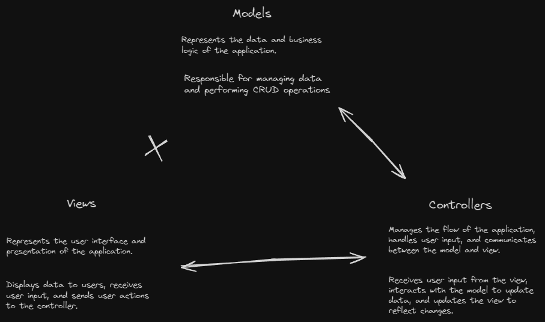

<h1 align="center">
PHP Authentication system
</h1>

This project serves as a testiment to my understanding of frontend and backend web development. I used various languages in order to produce a functional login system that defends against common attacks such as XSS, CSRF or SQL injection.

 

    

 

This project was written with MVC in mind. This is a commonly followed web standard that outlines a consistent folder structure to ensure best practise.
